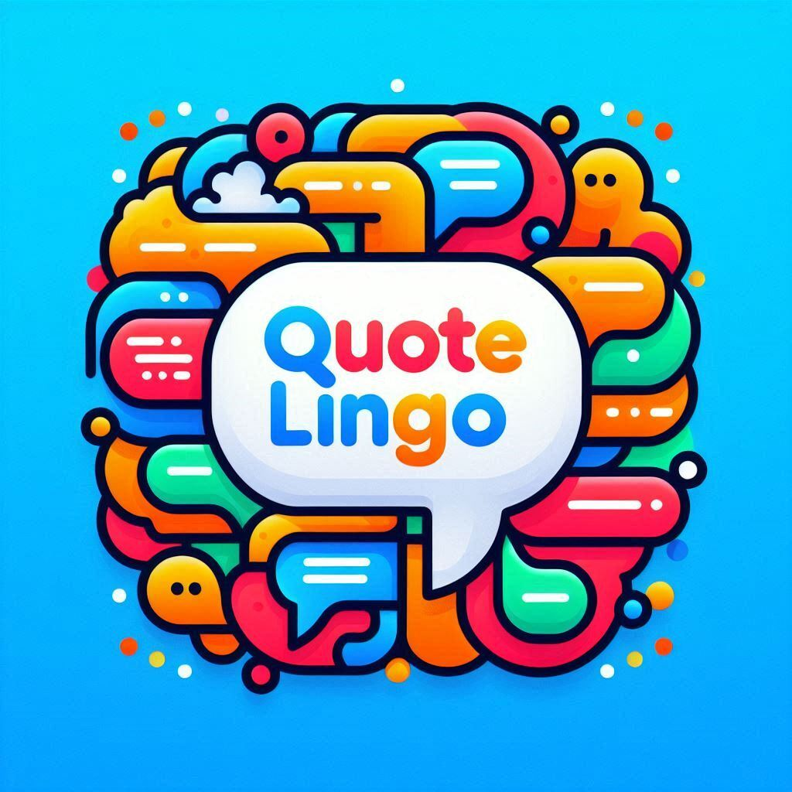

# Project Retrospective and overview 

[Video Walkthrough](https://drive.google.com/file/d/1-0gD1-vVK_uTJQ4WHjX75x5OTj5rjwWV/view?usp=sharing)

[Github Repo](https://github.com/AhmedTurkiii/CST438-SWE-Project1)

## Overview

QuoteLingo is an application intended to help users learn other languages by providing quotes fetched from this [API](https://rapidapi.com/martin.svoboda/api/quotes15). Users are able to translate the quote to a few different languages and save some of their favorite quotes to look back on later. 

## Introduction

* How was communication managed
*    Communication was managed via Slack, and we also tended to have Zoom meetings outside of class. 
* How many stories/issues were initially considered
   * We initially considered 12 stories/issues.      
* How many stories/issues were completed
   * We were able to complete 15 stories/issues.     

## Team Retrospective

### Team Member name

- [Ahmed Torki](https://github.com/AhmedTurkiii/CST438-SWE-Project1/tree/torki_branch)
- [Alexia Leon](https://github.com/AhmedTurkiii/CST438-SWE-Project1/tree/leon_branch)
- [Jonathan Ramirez](https://github.com/AhmedTurkiii/CST438-SWE-Project1/tree/JR_Branch2)
- [RUll Mendez](https://github.com/AhmedTurkiii/CST438-SWE-Project1/tree/Rull_branch)

### What was your role / which stories did you work on

#### Ahmed Torki
I Worked on developing the application home page that display the current quote and include the option to add the quotes to the favourite page, which required me to display all the liked quotes on the favourite page and enable the user to unlike it, also worked on the history page with Jonathan as I add the logic for fetching all the quotes fetch for this specfic user and I used global context to set the user as a global variable can be used accros the app within that session, I also worked on the Unit test setup using Jest.
+ What was the biggest challenge?
  + Time was definitely a challenge, especially cooperating with a team that has different availability times and works remotely. Additionally, defining who will work on which part of the project was crucial. In the app development context, one of the challenges was figuring out how to make the app use a single global user within one session and how to set and use the hooks.
+ Why was it a challenge?
  + How was the challenge addressed?
    It was challenging because it was our first time using React Native, and we encountered conflicts between React and Expo. To address this, we set weekly goals, scheduled Zoom meetings via Google Calendar, and discussed who would work on which parts. I also used React Native tutorials to learn how to set and share global variables across the app.
+ Favorite / most interesting part of this project
  + Most interesting part was when I had an issue of repeated records displayed on the front-end and there was some solutions to address this issue, but using SQL DISTINCT function was really effecient on this part as I was running out of time, also using a Physical Device and test the application on it while developing and fixing issues was fun to me! :)
+ If you could do it over, what would you change?
  + I would use the time effeciently as we were planning to add more features to the application.
+ What is the most valuable thing you learned?
  + Being mindful and start doing the task as early as you can.

#### Alexia Leon
I worked on developing the Favorites page and implementing API functionality to fetch quotes. I also helped build the login page, connecting it to the database for user authentication, and played a role in setting up the database and creating the user table. 

+ What was the biggest challenge?
   + The biggest challenge for me was building the project while also learning how to use React. 
+ Why was it a challenge?
   + It was challenging because we had only three weeks to not only complete the project but also learn how to effectively use React.
  + How was the challenge addressed?
   +To tackle this, I constantly searched for online resources and tutorials to help me understand React and its best practices 
+ Favorite / most interesting part of this project
   + My favorite part of the project was the quote translation feature. I enjoyed designing the buttons for different languages, and I was really pleased with how smoothly the feature functions.
+ If you could do it over, what would you change?
   + If I had the chance to do it over, I would spend more time focusing on the visual design of the application to make it more aesthetically pleasing.
+ What is the most valuable thing you learned?
  +I learned how to effectively integrate an API into a React application. 

#### Jonathan Ramirez
I worked on creating the history page and creating the Database tables we needed for our project.

+ What was the biggest challenge?
   + I think the biggest challenge for me was having to get the database set up to function with our API and constantly having to battle with the project to get it to run.
+ Why was it a challenge?
   +  This was a challenge because we had to figure out how to create and fill the database with tables and values in three weeks as well as figuring out how to run the project with all the errors.
  + How was the challenge addressed?
   + I had to research quite a bit on how React works and how it handles databases to figure it out.  
+ Favorite / most interesting part of this project
   + I'd say my favorite part of this project was how well our logo came out and the overall style of the project.
+ If you could do it over, what would you change?
   + If I were able to do it over, I would change the APIs to maybe find one that could've worked better with what we needed. 
+ What is the most valuable thing you learned?
   + The most valuable thing I feel like I learned is how React handles a lot of its core functions and Databases.

#### Rull Mendez
I was working on creating the login page and creating a new languages ​​page connected to the database but was having trouble finishing it.

+ What was the biggest challenge?
  + My biggest challenge with this project was trying to create this project without knowing much or anything about react native.
+ Why was it a challenge?
  + Because from the beginning I didn't have much knowledge about React Native that we need to make an application that works with React Native.
    + How was the challenge addressed?
      + I had to watch videos on YouTube and search for information on Google and use ChatGPT to answer some questions related to React Native.
+ Favorite / most interesting part of this project
  + Making the page I was creating work even though in the end I didn't add it because there wasn't enough time and it's better to prioritize making the application work
+ If you could do it over, what would you change?
  + Getting my part of the project working and connected to the database, showing my learning and progress.
+ What is the most valuable thing you learned?
  + The most valuable thing I learned is how to use React efficiently, although I made several mistakes. With experience, I will make the next one better when using it.

### Ahmed Torki
1. Ahmed's pull requests are [here](https://github.com/AhmedTurkiii/CST438-SWE-Project1/issues?q=%20is%3Apr%20author%3AAhmedTurkiii%20)
1. Ahmed's Github issues are [here](https://github.com/AhmedTurkiii/CST438-SWE-Project1/issues?q=assignee%3AAhmedTurkiii)

### Alexia Leon
1. Alexia's pull requests are [here](https://github.com/AhmedTurkiii/CST438-SWE-Project1/pulls?q=author%3AAlexialeon0+)
1. Alexia's Github issues are [here](https://github.com/AhmedTurkiii/CST438-SWE-Project1/issues?q=is%3Aopen+is%3Apr+author%3A%40me)

### Jonathan Ramirez
1. Jonathan's pull requests are [here](https://github.com/AhmedTurkiii/CST438-SWE-Project1/issues?q=is%3Apr%20author%3AJoaleramirez)
1. Jonathan's Github issues are [here](https://github.com/AhmedTurkiii/CST438-SWE-Project1/issues?q=assignee%3AJoaleramirez)

### Rull Mendez
1. Rull's pull requests are [here](https://github.com/AhmedTurkiii/CST438-SWE-Project1/issues?q=is%3Apr%20author%3AShiro219)
1. Rull's Github issues are [here](https://github.com/AhmedTurkiii/CST438-SWE-Project1/issues?q=assignee%3AShiro219)

## Conclusion

- How successful was the project?
  - Overall, the project was successful. We were able to build an application that achieved all of its intended goals. 
- What was the largest victory?
  - The largest victory was resolving the database issues and ensuring that the quotes from the API were being saved smoothly.
- Final assessment of the project
  - This was a great first project. Given that we had no prior experience with React, we did an excellent job creating a fully functional application. 
